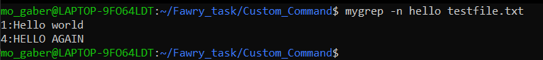
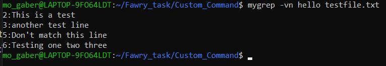
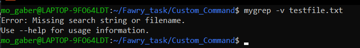

# `mygrep.sh` — Custom Command Reflection
## 📂 Script Installation
To make `mygrep.sh` available globally without typing `./`,  
I placed the script into `/usr/local/bin`:

```bash
sudo cp mygrep.sh /usr/local/bin/mygrep
sudo chown root:root /usr/local/bin/mygrep
```
Now I can run it from anywhere simply by typing:
```bash

## 📸 Screenshots

### 1. Basic search
```bash
mygrep hello testfile.txt
```


---

### 2. Search with line numbers
```bash
mygrep -n hello testfile.txt
```


---

### 3. Search with inverted match and line numbers
```bash
mygrep -vn hello testfile.txt
```


---

### 4. Missing search string (error case)
```bash
mygrep -v testfile.txt
```


---


# 🧠 Reflective Section

## 1. How the script handles arguments and options

The script starts by checking if any arguments were passed. If none are provided, it exits with an error. If the `--help` flag is provided, it displays usage information and exits.

For option parsing, it uses `getopts` to handle `-n` and `-v` flags:
- `-n` sets a variable `show_line_numbers=true` to display line numbers.
- `-v` sets a variable `invert_match=true` to invert the match logic.

After parsing the options, the script uses `shift` to correctly position the remaining arguments: the search string and the filename. It validates if both are provided and if the file exists. Then, it reads the file line-by-line and uses a case-insensitive `grep -i` inside a loop to determine if the line matches the search string. Based on the options set, it decides whether to display the line, prepend a line number, or invert the match.

---

## 2. If you were to support regex or -i/-c/-l options, how would your structure change?

If I were to support regular expressions or additional options like `-i` (ignore case), `-c` (count matching lines), or `-l` (list matching filenames), I would modularize the script further:
- Introduce variables like `case_insensitive`, `count_only`, and `list_only`.
- Create separate functions like `match_line()`, `count_matches()`, and `list_matching_files()` to cleanly handle each operation.
- Adjust the internal matching logic to handle regex safely.
- Use a final phase to decide whether to print lines, counts, or filenames based on the flags set.

The option parsing would also need to support combinations and default behaviors more carefully. Using `getopts` with extended patterns or switching to `getopt` (enhanced) might be needed for complex parsing.

---

## 3. What part of the script was hardest to implement and why?

The hardest part was correctly handling the combination of options `-v` and `-n`, especially when both were provided in any order (e.g., `-vn` or `-nv`). It required careful logic to ensure that the line matching and output formatting respected both flags without conflict. Another tricky part was ensuring proper input validation, specifically detecting when the user forgot to provide a search string or filename after the options, and displaying helpful error messages without letting the script crash.

---
