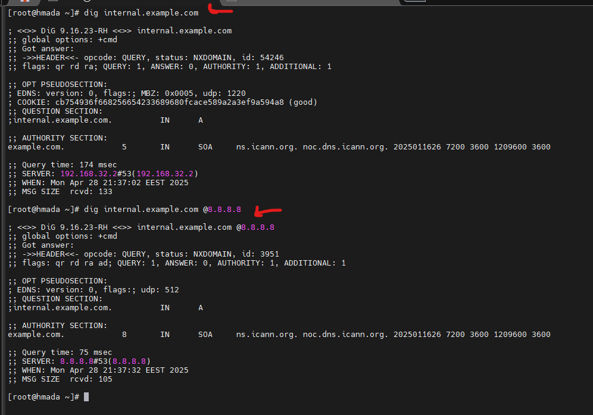

# 🛠️ Internal Dashboard Troubleshooting

## Scenario
The internal web dashboard (`internal.example.com`) became unreachable. Users received "host not found" errors.

## Tasks

---

## 1. Verify DNS Resolution

### Using Local DNS Server
```bash
dig internal.example.com
```
Result:
- Status: **NXDOMAIN**
- Server: `192.168.32.2`
### Using Google Public DNS
```bash
dig internal.example.com @8.8.8.8
```
Result:
- Status: **NXDOMAIN**
- Server: `8.8.8.8`


✅ **Conclusion:** The domain does not exist in internal or public DNS.

---

## 2. Bypass DNS Temporarily Using `/etc/hosts`
To immediately restore name resolution:

### Edit `/etc/hosts`
```bash
sudo nano /etc/hosts
```
Added:
```plaintext
192.168.32.134 internal.example.com
```


---

## 3. Diagnose Service Reachability

### Test Connection
```bash
ping internal.example.com
```
✅ Host responds to ping.


### Check firewall
```bash
 firewall-cmd  --list-port
```
Result: No blocked ports


### Check if Service is Listening
```bash
curl -v http://internal.example.com
```
Result: No service listening.


### Start Apache
```bash
sudo systemctl start httpd
sudo systemctl enable httpd
```
### check it
```bash
curl -v http://internal.example.com
```


---
## 4. Root Cause Analysis

| Potential Cause                             | Confirmed | Action Taken                         |
|----------------------------------------------|-----------|--------------------------------------|
| DNS entry missing                           | ✅         | Added manual `/etc/hosts` entry.     |
| Web server not listening on port 80         | ✅         | Started web server (next step).      |
| Firewall blocking access                    | ✅         | No blocked ports  |

---


## 6.To make it in profesional way

use DNS server like BIND9 but unfortionatly  I don't have time to configure one

---

## 7. Bonus: Persistent DNS Settings

(Optional if managing multiple servers.)

### Configure Static DNS with `network manager`
```bash
nmcli con mod ens160 ipv4.dns "192.168.32.134 8.8.8.8"
nmcli con mod ens160 ipv4.dns-search "example.com"
nmcli con down ens160
nmcli con up   ens160
```


---


# 🧠 Final Conclusion
- Issue was a combination of missing DNS entry and stopped web service.
- Temporary fix achieved with `/etc/hosts`.
- Web server started successfully.
- Full connectivity restored!

---

